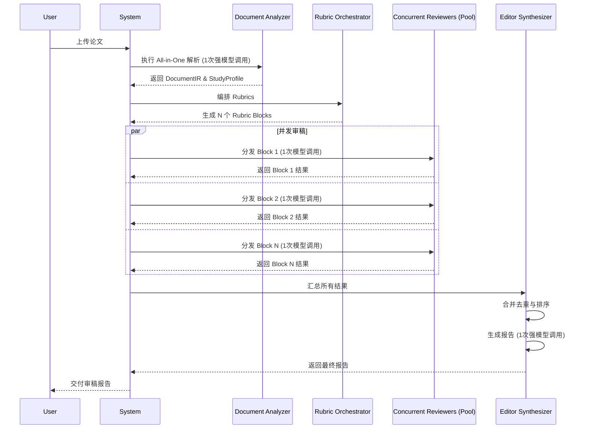

# 医学 SCI 论文自动审稿系统：算法与系统设计文档

---

## 一、系统目标与设计边界

### 1. 系统定位

本系统定位为医学学术期刊（特别是 SCI 收录期刊）的 **“预审与辅助审稿（Pre-review）”** 平台。其核心任务是在稿件送交人类同行评议专家之前，进行自动化的、结构化的初步筛查。系统旨在识别稿件在报告规范、方法学严谨性、统计学合理性以及伦理合规性等方面存在的潜在风险与缺陷，并生成结构化的审稿报告与具体的修改建议。

**关键定位：**

*   **辅助工具，而非替代品**：本系统不旨在替代人类审稿专家的深度评估、创新性判断与最终决策，而是作为一种高效的辅助工具，帮助编辑部和审稿人过滤低质量稿件、统一审稿标准、提升审稿效率。
*   **风险识别与建议生成**：系统的主要产出是结构化的风险清单和可执行的修改建议，而非对论文的整体性接受或拒绝判断。

### 2. 核心原则

为确保系统的权威性、可靠性与工程可行性，设计与实现遵循以下核心原则：

*   **不微调大模型（No Fine-tuning）**：鉴于医学领域的知识更新速度与微调带来的“知识幻觉”和“灾难性遗忘”风险，本系统不依赖于对通用大语言模型（LLM）进行特定领域知识的微调。所有医学知识与审稿逻辑均通过外部化的、可随时更新的 Checklist/Rubric 体系注入。
*   **Checklist / Rubric 驱动**：系统的审稿逻辑严格遵循由国际权威医学报告指南（如 CONSORT, PRISMA, STROBE 等）转化而来的清单（Checklist）与评分标准（Rubric）。所有评估均基于明确、可量化的规则，避免自由生成（Free Generation）带来的不确定性和不可靠性。
*   **判断可追溯（Evidence-based & Traceable）**：系统做出的每一项判断、识别的每一个风险点，都必须提供直接来源于论文原文的证据（Evidence Quote）和精确位置（Location），确保所有结论的可追溯性和可验证性。
*   **强并发、低延迟、可扩展（High-Concurreny, Low-Latency, Scalable）**：架构设计必须支持对海量稿件的高并发处理能力，并通过优化的调用策略与并发粒度设计，将单篇论文的端到端审稿延迟控制在分钟级别。系统应具备良好的水平扩展能力，以应对未来业务增长。

### 3. 适用范围

本系统旨在覆盖临床医学及公共卫生领域 SCI 论文所涉及的绝大多数研究方法学类型，具体包括但不限于：

*   **干预性研究**：随机对照试验（RCTs）、非随机对照试验等。
*   **观察性研究**：队列研究、病例-对照研究、横断面研究等。
*   **证据综合**：系统综述、Meta分析（包括网络Meta分析、个体患者数据Meta分析）。
*   **诊断与预测研究**：诊断准确性试验、预后模型、预测模型开发与验证（包括基于 AI/ML 的模型）。
*   **经济学评价**：成本-效果分析、预算影响分析等。
*   **其他类型**：指南、专家共识、病例报告、定性研究、动物实验等。

此外，系统特别设计了对 **混合方法学论文** 的支持能力，例如一篇论文可能同时包含真实世界数据（RWD）分析和一个基于此开发的预测模型，系统能够识别并调用相应的多个 Checklist 进行组合审稿。

---

## 二、总体系统架构（端到端）

本系统采用基于“文档解析-结构化表示-并发审稿-报告合成”的流水线架构，旨在实现效率与深度的平衡。通过将串行依赖最小化、并发处理最大化，确保系统在保证审稿质量的同时，实现低延迟的响应能力。

### 1. 架构说明

系统处理流程分为以下几个核心模块：

1.  **文档解析与清洗 (Document Parsing & Cleaning)**：接收用户上传的论文（如 .docx, .pdf, .tex 格式），进行格式转换、文本提取、图表识别、参考文献解析等预处理操作，输出纯净的文本内容与结构化元数据。
2.  **结构化中间表示 (DocumentIR)**：此模块是系统的核心数据基石。通过一次 LLM 调用，将全文解析为统一的、结构化的中间表示（DocumentIR）。DocumentIR 不仅包含按章节（引言、方法、结果、讨论）组织的文本块，还包括关键信息的高度结构化提取，如研究设计、样本量、主要结局、统计方法等。同时，此模块会完成 **研究类型识别（Study Design Identification）**，以多标签形式（e.g., `['RCT', 'Prognostic Model']`）输出论文的方法学类型。
3.  **合规与安全前置防护 (Integrity & Ethics Guard)**：在进入核心审稿流程前，一个轻量级的安全 Agent 会并发执行，对文本进行扫描，检测是否存在 Prompt Injection、隐藏指令、不可见文本等恶意攻击，并基于规则进行初步的伦理合规筛查（如是否提及伦理委员会批准）。此模块以规则为主，LLM 为辅，确保基础安全性。
4.  **Checklist / Rubric 编排 (Rubric Orchestrator)**：该模块是审稿任务的“总调度中心”。它首先触发一个通用的、适用于所有研究类型的兜底 Rubric（Universal Medical Manuscript Rubric, UMMR）。然后，根据 DocumentIR 中识别出的研究类型标签，从 Rubric Library 中加载一个或多个专项 Rubric（如 CONSORT 2010, TRIPOD-AI）。Orchestrator 负责将这些 Rubric 分解为并发执行的任务单元（Rubric Blocks）。
5.  **多 Agent 并发审稿 (Multi-Agent Concurrent Review)**：这是系统的核心执行引擎。多个无状态的 **Methodology Reviewer Agent** 和一个 **Statistician Reviewer Agent** 会被并发调度。每个 Agent 接收一个或多个 Rubric Block，仅访问 DocumentIR 和预先构建的 EvidenceMap（证据索引），对论文的特定方面（如随机化过程、偏倚风险、统计检验合理性）进行独立审查，并输出结构化的评估结果。
6.  **合成与报告生成 (Editor Synthesizer)**：在所有并发审稿任务完成后，**Editor Synthesizer Agent** 作为唯一的串行瓶颈，负责收集、汇总所有 Agent 的输出。它会进行风险去重、严重性排序、逻辑归纳，并最终生成两份独立的报告：一份面向作者（Author Report），提供详细的问题清单和修改建议；另一份面向期刊编辑（Editor Report），提供“是否建议送审”的总体判断及核心风险摘要。

### 2. 系统流程图


**图 1：系统总体架构流程图**

<details>
<summary>查看 Mermaid 源码</summary>

```mermaid
graph TD
    subgraph "串行前处理"
        A[用户上传稿件 .docx/.pdf] --> B{文档解析与清洗};
        B --> C{结构化中间表示 DocumentIR};
        C --> D[研究类型识别(多标签)];
    end

    subgraph "并发处理层"
        E[Integrity & Ethics Guard] --> F{安全合规检查};
        D --> G[Rubric Orchestrator];
        G --> H1[通用兜底 Rubric (UMMR)];
        G --> H2[专项 Rubric 1 (e.g., CONSORT)];
        G --> H3[专项 Rubric 2 (e.g., TRIPOD)];
        
        subgraph "并发审稿 Agents"
            direction LR
            I1[Methodology Reviewer 1];
            I2[Methodology Reviewer 2];
            I3[...];
            I4[Methodology Reviewer N];
            J[Statistician Reviewer];
        end
        
        H1 --> I1;
        H2 --> I2;
        H3 --> I3;
        H1 --> J;
        H2 --> J;
    end

    subgraph "串行后处理"
        K[Editor Synthesizer] --> L{合并去重、风险排序};
        L --> M{生成最终报告};
        M --> N1[Author Report];
        M --> N2[Editor Report];
    end

    C --> E;
    I1 --> K;
    I2 --> K;
    I3 --> K;
    I4 --> K;
    J --> K;
    F --> K;

    style A fill:#f9f,stroke:#333,stroke-width:2px
    style N1 fill:#bbf,stroke:#333,stroke-width:2px
    style N2 fill:#bbf,stroke:#333,stroke-width:2px
```

</details>

### 3. 串行与并发逻辑

*   **串行模块**：
    *   **文档解析 -> 结构化表示**：必须先完成全文的解析和结构化，才能进行后续的任何分析。这是整个流程的数据基础，因此是严格串行的。
    *   **报告合成**：必须等待所有并发审稿 Agent 完成工作并提交结果后，才能进行最终的汇总、排序和报告生成。这是保证报告完整性和一致性的必要步骤。

*   **并发模块**：
    *   **安全合规检查**：该模块的检查不依赖于详细的方法学审稿，可以与 Rubric 编排和审稿任务并行执行，提前发现基础安全问题。
    *   **方法学与统计学审稿**：这是系统设计的核心并发点。一篇论文的不同评估维度（如样本量计算、随机化方法、盲法实施、统计检验选择）在逻辑上是高度解耦的。通过将一个大的 Checklist 拆分为多个独立的 Rubric Block，可以指派给大量并发的、无状态的 Reviewer Agent。这些 Agent 共享只读的 DocumentIR，互不干扰，从而极大地缩短了审稿总时长。并发的粒度被设计为“Rubric Block”，每个 Block 包含 5-8 个相关的评估项，以平衡任务分发的开销和执行效率。

---

## 三、Agent 架构（已优化版）

系统采用“最小 Agent 集 + 最大并发度”的精简设计哲学，避免角色冗余和复杂的 Agent 间通信。最终固化的 Agent 角色共 6 类，各司其职，通过统一的消息协议（ReviewState Schema）进行协作。

### 1. Document Analyzer Agent

*   **Definition**: 负责将原始、非结构化的论文文本转化为高度结构化、可供下游所有 Agent 使用的 DocumentIR 和研究元数据。它合并了“全文结构化抽取”和“研究类型识别”两个关键任务。
*   **Inputs**: 纯净的论文全文文本（字符串）。
*   **Pipeline**:
    1.  构造一个复杂的、包含多任务指令的 Prompt，要求 LLM（推荐使用具备强大函数调用或 JSON 输出能力的模型）执行以下操作：
        *   将全文分割为 Title, Abstract, Introduction, Methods, Results, Discussion, References, Appendices 等标准章节。
        *   从各章节中提取关键的结构化信息，如：研究目的、主要/次要终点、样本量及计算依据、入排标准、干预/对照措施、统计分析方法、主要发现、局限性等。
        *   根据“方法”章节的描述，对研究的方法学类型进行多标签分类（e.g., `['RCT', 'Diagnostic Study']`）。
    2.  执行单次 LLM 调用。
    3.  验证输出的 JSON 格式是否符合预定义的 DocumentIR Schema，若失败则进行格式修复或重试。
*   **Outputs**: 一个 JSON 对象，包含 `DocumentIR` 和 `StudyProfile`。
    *   `DocumentIR`: 包含全文分章节文本及结构化信息的对象。
    *   `StudyProfile`: 包含研究类型多标签（`study_types`）和关键元数据（`metadata`）的对象。
*   **KPIs**: 
    *   结构化信息提取的准确率与召回率 > 95%。
    *   研究类型识别准确率 > 98%。
    *   处理延迟 < 60秒。

### 2. Integrity & Ethics Guard

*   **Definition**: 一个轻量级的安全与基础伦理审查 Agent，前置于核心审稿流程，以规则引擎为主，LLM 为辅，快速筛查明显的违规和攻击行为。
*   **Inputs**: 纯净的论文全文文本（字符串）。
*   **Pipeline**:
    1.  **并发执行以下规则检查**：
        *   使用正则表达式库扫描是否存在已知的 Prompt Injection 攻击模式。
        *   检测是否存在零宽度字符、颜色隐藏等不可见文本攻击。
        *   检查“方法”部分是否明确提及“伦理委员会批准 (IRB/EC approval)”和“知情同意 (Informed Consent)”等关键词。
    2.  **（可选）LLM 补充检查**：如果规则检查发现可疑模式，可调用一个小型、高速的 LLM 进行意图判断。
    3.  输出结构化的安全与伦理风险标记。
*   **Outputs**: 一个 `SecurityAlerts` 数组，每个 Alert 包含 `type`, `severity`, `evidence`。
*   **KPIs**: 
    *   已知攻击模式检出率 100%。
    *   处理延迟 < 5秒。

### 3. Rubric Orchestrator

*   **Definition**: 审稿流程的“总指挥”，负责根据研究类型动态编排和分发审稿任务。
*   **Inputs**: `StudyProfile` 对象。
*   **Pipeline**:
    1.  从 Rubric Library 中加载 **通用兜底 Rubric (UMMR)**，该 Rubric 包含所有研究类型共通的评估项（如标题、摘要、利益冲突声明等）。
    2.  遍历 `StudyProfile.study_types` 中的每一个标签。
    3.  根据每个标签，从 Rubric Library 中加载对应的 **专项 Rubric**（如为 `RCT` 加载 `CONSORT 2010`，为 `Prognostic Model` 加载 `TRIPOD`）。
    4.  将所有加载的 Rubric 合并，并按逻辑关联性划分为多个 **Rubric Block**（每个 Block 包含 5-8 个 Rubric Item）。
    5.  为每个 Rubric Block 创建一个独立的并发任务，分发给下游的 Reviewer Agents。
    6.  监控所有并发任务的状态，并在全部完成后，将结果汇总传递给 Editor Synthesizer。
*   **Outputs**: 一系列并发任务的句柄，以及最终汇总的 `AggregatedReviewResults`。
*   **KPIs**: 
    *   Rubric 匹配准确率 100%。
    *   任务分发延迟 < 1秒。

### 4. Methodology Reviewer (并发执行)

*   **Definition**: 核心审稿执行单元，以最大并发度运行。每个 Reviewer 是无状态的，负责执行一个或多个 Rubric Block 中定义的具体评估项。
*   **Inputs**: 
    *   `DocumentIR` (只读)。
    *   `EvidenceMap` (只读，一个预先构建的、从关键术语到原文位置的索引，用于加速证据查找)。
    *   一个 `RubricBlock` 对象。
*   **Pipeline**:
    1.  遍历 `RubricBlock` 中的每一个 `RubricItem`。
    2.  对于每个 `RubricItem`，其定义包含了需要检查的“问题”和“评估标准”。
    3.  构造一个针对性的、小型的 Prompt，指令 LLM 在 `DocumentIR` 的指定章节（如 Methods, Results）中寻找与该 `RubricItem` 相关的信息。
    4.  **严格复用 EvidenceMap**：在 Prompt 中优先利用 `EvidenceMap` 提供的线索，引导 LLM 直接关注相关段落，避免全文扫描。
    5.  要求 LLM 根据找到的证据，按照预定义的 `RubricItemOutputSchema` 格式返回判断结果（得分、严重性、证据引用等）。
    6.  收集该 Block 内所有 Item 的结果。
*   **Outputs**: 一个 `BlockReviewResult` 数组，每个元素都符合 `RubricItemOutputSchema`。
*   **KPIs**: 
    *   单 Block 平均处理延迟 < 20秒。
    *   LLM 调用失败率 < 1%。

### 5. Statistician Reviewer

*   **Definition**: 一个特殊的审稿 Agent，专注于论文中的统计学方法、偏倚风险、模型验证和结果稳健性。它不直接读取长篇文本，而是消费高度结构化的信息。
*   **Inputs**: 
    *   `DocumentIR` 中结构化提取的统计学相关字段（如统计方法、p-值、置信区间、样本量计算等）。
    *   `EvidenceMap` (只读)。
    *   专门为其设计的 `StatisticsRubricBlock`。
*   **Pipeline**:
    1.  与 Methodology Reviewer 类似，但其 Prompt 专注于评估统计逻辑的合理性。
    2.  例如，检查样本量计算是否合理、统计检验的选择是否与数据类型和研究设计匹配、是否考虑了多重比较问题、预测模型的验证方法是否恰当（如交叉验证、外部验证）。
    3.  同样，所有判断都必须索引到 `DocumentIR` 中的证据。
*   **Outputs**: 一个 `BlockReviewResult` 数组，专注于统计学问题。
*   **KPIs**: 
    *   关键统计学谬误识别率 > 90%。
    *   处理延迟 < 30秒。

### 6. Editor Synthesizer

*   **Definition**: 流程中唯一的串行瓶颈和强模型调用点。作为“总编辑”，负责将碎片化的审稿意见整合成一份逻辑清晰、可读性强的最终报告。
*   **Inputs**: `AggregatedReviewResults` (包含所有 Reviewer Agent 的输出)。
*   **Pipeline**:
    1.  **合并去重**：不同 Rubric 之间可能存在重叠的评估点（如 CONSORT 和 SPIRIT 都关心终点指标的定义）。此步骤负责识别并合并这些重复的发现。
    2.  **风险排序**：根据每个发现的 `severity` (CRITICAL, MAJOR, MINOR) 和预设的权重规则，对所有问题进行优先级排序。
    3.  **调用强模型 (e.g., GPT-4-Turbo, Claude 3 Opus)**：构造一个包含所有排序后风险点和证据的 Prompt，执行以下任务：
        *   **生成 Author Report**：将技术性的风险点转化为面向作者的、礼貌且建设性的修改建议，按问题类别（如研究设计、统计、图表）组织。
        *   **生成 Editor Report**：为期刊编辑撰写一份高度浓缩的摘要，总结核心风险，并给出一个明确的初步建议（如：直接拒稿、需要大修后重审、小修后可接受、建议送审）。
*   **Outputs**: 两个独立的 Markdown 文本：`AuthorReport.md` 和 `EditorReport.md`。
*   **KPIs**: 
    *   报告的可读性和逻辑性评分 > 4.5/5.0。
    *   处理延迟 < 90秒。

### 7. Agent 间消息协议 (ReviewState Schema)

Agent 之间的协作不通过直接通信，而是通过读写一个集中式的、状态化的 JSON 对象来完成，该对象遵循 `ReviewState` Schema。这降低了系统的耦合度。

```json
{
  "job_id": "uuid-1234-abcd",
  "manuscript_path": "/path/to/manuscript.docx",
  "status": "SYNTHESIZING", // PENDING, PARSING, REVIEWING, SYNTHESIZING, COMPLETED, FAILED
  "document_ir": { ... },
  "study_profile": { ... },
  "security_alerts": [ ... ],
  "orchestration": {
    "rubric_blocks": [ ... ],
    "task_status": { ... }
  },
  "review_results": {
    "block_id_1": [ ... ], // Array of RubricItemOutputSchema
    "block_id_2": [ ... ]
  },
  "final_reports": {
    "author_report": "...",
    "editor_report": "..."
  },
  "error_log": [ ... ]
}
```

### 8. 调度与失败重试 / 降级逻辑

*   **调度**: 使用基于消息队列（如 RabbitMQ, Celery）的异步任务调度系统。Rubric Orchestrator 作为生产者，将每个 Rubric Block 作为一个消息发布到队列中；大量的 Reviewer Agent 作为消费者，从队列中获取任务并执行。
*   **失败重试**: 
    *   **网络/API 错误**：对于 LLM 调用失败（如 503 服务不可用），采用指数退避策略进行最多 3 次自动重试。
    *   **解析/格式错误**：如果 LLM 返回的 JSON 格式错误，尝试使用一个更简单的模型或规则进行修复；若修复失败，则标记该 Rubric Item 为“执行失败”并记录错误，但不中断整个流程。
*   **降级逻辑 (Graceful Degradation)**:
    *   **局部失败**：单个 Rubric Item 或 Rubric Block 的执行失败不应导致整个审稿任务的崩溃。Editor Synthesizer 在汇总时会明确标注出哪些检查点未能成功执行。
    *   **强模型不可用**：如果用于合成的强模型 API 失败且无法恢复，系统将降级为基于模板的报告生成模式，直接罗列所有原始的、未经润色的风险点，确保至少有可用的原始输出。


---

## 四、低延迟与并发优化策略（重点章节）

系统的核心挑战之一是在保证审稿深度的前提下，实现工业级的低延迟。本章节详细阐述为达成此目标所采用的关键优化策略。

### 1. LLM 调用合并 (Call Consolidation)

**原则**：将多个逻辑相关、输入相似的 LLM 查询合并为单次、更复杂的调用，以大幅减少网络开销和模型加载时间。

**实践**：
*   **Document Analyzer Agent 的 All-in-One 解析**：这是系统中最显著的调用合并。传统的流程可能是：一次调用进行章节划分，一次调用识别研究类型，多次调用提取不同的结构化信息。本系统将所有这些任务整合到一个 Prompt 中，通过精巧的指令设计和要求 JSON 输出，让一次 LLM 调用就完成 **全文结构化、关键信息提取、研究类型识别** 三大任务。这至少将 5-10 次独立的 LLM 调用合并为 1 次，是前端处理阶段最重要的性能优化。

### 2. 并发粒度设计 (Concurrency Granularity)

**原则**：识别流程中可并行的独立任务单元，并将其设计为最优的并发粒度，以最大化利用计算资源。

**实践**：
*   **天然并发的审稿任务**：对一篇论文的不同方法学侧面进行评估，是天然可并行的。例如，评估“随机序列生成”和评估“统计分析方法”是两个独立的逻辑判断。
*   **并发粒度：Rubric Block**：
    *   **太细（一个 Rubric Item 一次调用）**：会导致极大量的 LLM 调用，尽管并发度高，但任务调度和网络开_销会成为瓶颈，成本也难以控制。
    *   **太粗（一个 Checklist 一次调用）**：Prompt 会变得异常复杂，超出大多数模型的上下文窗口或逻辑处理能力，导致输出质量下降，且无法实现内部并发。
    *   **最优选择**：本系统采用 **Rubric Block** 作为并发粒度。每个 Block 包含 5-8 个高度相关的 Rubric Item（例如，一个 Block 专门负责 CONSORT 中关于“盲法”的所有评估点）。这在并发度、LLM 调用成本和 Prompt 复杂度之间取得了最佳平衡。

### 3. 如何避免低效模式

*   **避免“一个 Rubric 一次 LLM 调用”**：通过上文提到的 **Rubric Block** 策略，将多个评估项打包到一次调用中，从根本上解决了这个问题。
*   **避免“重复读取全文”**：
    1.  **只读一次**：全文在流程开始时由 Document Analyzer Agent 读取并解析一次，生成权威的、只读的 `DocumentIR`。
    2.  **下游消费中间产物**：所有后续的并发 Agent（Methodology Reviewer, Statistician Reviewer）**绝不** 重新访问原始文件或全文文本。它们只消费 `DocumentIR` 这个结构化的、更易于机器处理的中间产物。
    3.  **证据索引加速**：通过预构建的 `EvidenceMap`，Agent 可以像查字典一样快速定位到相关证据在 `DocumentIR` 中的位置，避免了在长文本中进行昂贵的语义搜索。

### 4. 推荐的调用拓扑 (Call Topology)

下图展示了单篇论文处理过程中的 LLM 调用拓扑，清晰地体现了串并结合的优化思想。


**图 2：LLM 调用拓扑时序图**

<details>
<summary>查看 Mermaid 源码</summary>



</details>

### 5. 结论

*   **理想端到端延迟目标**：对于一篇典型的 8000 词论文，目标延迟控制在 **3 分钟以内**。
*   **单篇论文的 LLM 调用次数上限**：`1 (解析) + N (并发审稿Blocks) + 1 (合成)`。若一篇论文触发 3 个 Checklist，平均每个 Checklist 包含 25 个 item，按每个 Block 5 个 item 计算，N 约为 `(25*3)/5 = 15`。总调用次数约为 **17 次**，这是一个完全可控的数量。
*   **Token 与成本控制策略**：
    *   **缓存 (Caching)**：对于完全相同的论文（基于文件哈希值），可直接返回缓存的审稿结果。
    *   **早停 (Early Stopping)**：在 Integrity & Ethics Guard 阶段发现严重问题（如抄袭、伪造数据），或在审稿中发现多个 CRITICAL 级别的缺陷时，可由策略决定提前终止后续审稿，直接生成拒稿报告，节省成本。
    *   **分块 (Chunking)**：对于 `DocumentIR` 中特别长的文本章节（如讨论），在传递给 Reviewer Agent 时可以只传递最相关的段落，减少上下文 Token。
    *   **模型分级**：仅在 Document Analyzer 和 Editor Synthesizer 这两个需要强大理解和生成能力的节点使用最强的 LLM。中间并发的 Reviewer Agent 可以使用速度更快、成本更低的次级模型，因为它们的任务更具体、更聚焦。

---

## 五、Checklist 驱动的 Rubric 体系（核心章节）

本系统的权威性根植于其全面、结构化的医学报告规范 Checklist 体系。该体系源自国际公认的循证医学标准，并被工程化为机器可执行的 Rubric。

### 1. 权威医学 Checklist 体系总览

系统内置的 Checklist Library 按研究方法学类型组织，确保了广泛的覆盖度。所有 Checklist 均采用其最新版本。

| 类别 | Checklist 名称 | 核心用途 |
| :--- | :--- | :--- |
| **通用 / 伦理 / 证据质量** | ICMJE Recommendations | 作者资格、利益冲突、数据共享等通用规范 |
| | COPE Guidelines | 出版伦理，如重复发表、数据伪造等 |
| | GRADE | 证据质量分级和推荐强度评定框架 |
| | RoB 2 | 随机对照试验的偏倚风险评估工具 |
| | ROBINS-I | 非随机干预性研究的偏倚风险评估工具 |
| | PROSPERO | 系统综述的方案预注册检查 |
| | SPIRIT 2013 | 临床试验证验方案的报告规范 |
| **随机对照试验 (RCT)** | CONSORT 2010 / 2025 | 随机对照试验报告规范（核心标准） |
| | CONSORT-Cluster | 整群随机试验的扩展声明 |
| | CONSORT-Pragmatic | 实效性随机试验的扩展声明 |
| | CONSORT-Non-Inferiority | 非劣效性/等效性试验的扩展声明 |
| | CONSORT-Harms | 试验中危害事件报告的扩展声明 |
| **系统综述 / Meta分析** | PRISMA 2020 | 系统综述和Meta分析报告规范（核心标准） |
| | PRISMA-IPD | 个体患者数据系统综述的扩展声明 |
| | PRISMA-NMA | 网络Meta分析的扩展声明 |
| | PRISMA-Scoping | 范围综述的扩展声明 |
| | AMSTAR 2 | 系统综述的方法学质量评价工具 |
| **观察性研究 / RWD** | STROBE | 观察性研究报告规范（队列、病例-对照、横断面） |
| | RECORD | 使用常规健康数据（RWD）的研究报告规范 |
| | RECORD-PE | 使用常规健康数据的预测性研究报告规范 |
| **预测 / 诊断 / AI** | TRIPOD / TRIPOD-AI | 预测/预后模型开发与验证的报告规范 |
| | STARD / STARD-AI | 诊断准确性研究的报告规范 |
| | DECIDE-AI | AI决策支持系统的早期临床评估报告规范 |
| **经济学评价** | CHEERS 2022 | 卫生经济学评价报告规范 |
| | ISPOR Good Practices | ISPOR发布的各类经济学研究最佳实践 |
| | Budget Impact Analysis | 预算影响分析的指南 |
| **指南 / 共识** | AGREE II | 临床实践指南的评估工具 |
| | RIGHT | 临床实践指南的报告规范 |
| | WHO Guideline Handbook | WHO指南制定手册 |
| **病例 / 定性 / 实施** | CARE | 病例报告的报告规范 |
| | COREQ | 定性研究（访谈、焦点小组）的报告规范 |
| | SQUIRE 2.0 | 医疗质量促进研究的报告规范 |
| | TIDieR | 干预措施描述与复制的指南 |
| **动物 / 基础研究** | ARRIVE 2.0 | 活体动物实验的报告规范 |
| **量表 / 工具开发** | COSMIN | 健康相关结局测量工具开发研究的报告规范 |

### 2. Checklist 到 Rubric Item 的映射原则

将学术性的 Checklist 转化为工程可用的 Rubric Item，遵循以下原则：

*   **原子化 (Atomization)**：将 Checklist 中的每一个条目（即使是一个条目包含多个子问题）拆分为一个独立的、可被机器评估的 **原子化 Rubric Item**。例如，CONSORT 第8a条“随机序列的生成方法”，会被映射为一个独立的 Rubric Item。
*   **问题化 (Interrogation)**：将每个原子化条目转化为一个清晰、封闭式的“问题”，用于指导 LLM 进行判断。例如，上述条目会转化为：“论文是否明确描述了用于生成随机分配序列的具体方法（如计算机生成的随机数、随机数表）？”
*   **证据导向 (Evidence-orientation)**：每个 Rubric Item 都必须包含一个 `evidence_location_hint` 字段，提示 LLM 应该在 `DocumentIR` 的哪个部分（如 `methods.randomization`）寻找证据。
*   **标准化输出 (Standardized Output)**：每个 Rubric Item 的执行结果都必须遵循统一的 `RubricItemOutputSchema`，包含分数、严重性、证据引用等字段，确保下游处理的一致性。

### 3. 一个研究如何命中多个 Checklist

系统通过 **研究类型多标签识别** 机制来处理复杂研究。在 `Document Analyzer` 阶段，系统会为一篇论文打上所有适用的方法学标签。例如，一篇“基于医院电子病历数据（真实世界数据）开发一个用于预测败血症风险的深度学习模型，并与传统评分进行比较”的论文，可能会被识别并打上以下标签：

*   `Real World Data Study`
*   `Prognostic Model`
*   `Artificial Intelligence`

`Rubric Orchestrator` 在收到这些标签后，会同时加载并编排以下 Checklist 对应的 Rubric：

1.  **RECORD**: 因为研究使用了常规健康数据。
2.  **TRIPOD-AI**: 因为研究开发并验证了一个基于 AI 的预测模型。
3.  **UMMR**: 通用兜底 Rubric 始终会被加载。

系统会将这三个 Rubric 的所有评估项合并、去重，然后分解为 Rubric Blocks，实现对这篇混合方法学论文的全面评估。

### 4. Checklist / Rubric 的版本管理与升级机制

医学报告规范会不断更新（如 CONSORT 2010 -> 2025）。为保证系统的权威性，Rubric Library 的版本管理至关重要。

*   **Git-based Library**: 整个 Rubric Library（以 YAML 或 JSON 文件的形式存储）被置于一个独立的 Git 版本控制仓库中。每一次对 Checklist 的更新、增加或修改都作为一次 commit 提交，拥有完整的历史记录。
*   **版本化加载**: 系统在启动时或通过特定 API 调用，可以指定加载特定版本（Git tag 或 commit hash）的 Rubric Library。这使得系统可以并行支持多个版本的规范，或在不同期刊之间应用不同的标准。
*   **持续集成 (CI)**: 建立一个 CI 流水线，定期扫描 EQUATOR Network 等权威来源，当检测到新的或更新的报告规范时，自动创建 issue，提醒方法学专家介入，更新 Git 仓库中的 Rubric 定义。更新后的 Rubric 在合并到主分支前，必须通过一套标准测试用例的回归测试。

---

## 六、Rubric 执行与并发策略

本章节深入探讨 Rubric 从定义到执行的具体工程实现，以及如何通过并发策略保证高效、稳健的运行。

### 1. Rubric Block 如何划分

Rubric Block 的划分并非随机，而是遵循 **逻辑内聚性** 原则。`Rubric Orchestrator` 在合并了所有命中的 Checklist 后，会按照以下逻辑对所有 Rubric Item 进行分组：

*   **按论文章节**：将与“引言”、“方法”、“结果”、“讨论”各部分相关的评估项分别聚合。
*   **按方法学主题**：在“方法”这个大组内，进一步细分为“研究设计”、“样本量”、“随机化”、“盲法”、“统计分析”等子主题 Block。
*   **平衡负载**：确保每个 Block 包含的 Item 数量大致均衡（5-8个），避免出现某些 Block 任务过重成为瓶颈。

例如，一个针对 RCT 论文的审稿任务可能会生成如下的 Rubric Blocks：
*   `Block_Intro_General`
*   `Block_Methods_Eligibility`
*   `Block_Methods_Randomization_Allocation`
*   `Block_Methods_Blinding`
*   `Block_Methods_Outcomes`
*   `Block_Methods_Statistics`
*   `Block_Results_Flowchart_Baseline`
*   `Block_Results_Outcomes_Harms`
*   `Block_Discussion_Limitations`

### 2. 每个 Block 的并发执行方式

系统采用 **异步任务队列模型** 实现高并发执行。

1.  **任务封装**：`Rubric Orchestrator` 将每个 Rubric Block 连同对 `DocumentIR` 和 `EvidenceMap` 的引用，封装成一个独立的、可序列化的任务消息。
2.  **入队**：将所有任务消息推送到一个消息队列（如 RabbitMQ 或 Redis）的特定主题中。
3.  **并发消费**：部署一个由大量 `Methodology Reviewer` Agent 组成的消费者集群。每个 Agent 都是一个独立的进程或容器，它们从队列中拉取任务，执行审稿，然后将结果写回一个共享的结果存储（如 Redis Hash 或数据库表）。
4.  **水平扩展**：当审稿请求量增加时，只需简单地增加消费者 Agent 的数量，即可线性提升系统的总处理能力。

### 3. EvidenceMap 如何被多个 Agent 复用

`EvidenceMap` 是一个在 `DocumentIR` 生成后立即创建的关键数据结构，它是一个 **从医学本体/关键词到其在 `DocumentIR` 中出现位置的索引**。

*   **结构示例**：
    ```json
    {
      "p-value": [ "results.text[3]", "tables[1].cell[2,3]" ],
      "confidence interval": [ "results.text[3]", "results.text[5]" ],
      "random forest": [ "methods.statistics.text[2]" ],
      "informed consent": [ "methods.ethics.text[1]" ]
    }
    ```
*   **构建方式**：通过高效的字符串匹配算法（如 Aho-Corasick）和一部分基于规则的实体识别，在 `DocumentIR` 上构建此索引。
*   **复用方式**：`EvidenceMap` 作为只读数据，与 `DocumentIR` 一起被打包进每个任务消息。当 Reviewer Agent 执行一个关于“p-值”的 Rubric Item 时，它会首先查询 `EvidenceMap`，得知 p-值主要出现在 `results.text[3]` 等位置。然后，它会构造一个更具针对性的 Prompt，指示 LLM **“请重点关注以下文本段落来回答问题...”**，从而避免了对全文的盲目搜索，极大提升了效率和准确性。

### 4. 局部失败如何不影响全局输出

健壮性是系统设计的关键。单个 Agent 或 LLM 调用的失败不应导致整个审稿任务的终止。

*   **任务级别的异常捕获**：每个 Reviewer Agent 在执行 Rubric Block 时，其核心逻辑被包裹在 `try...except` 块中。
*   **记录与标记**：如果一次 LLM 调用在重试后仍然失败，或者返回了无法解析的格式，该 Agent 不会崩溃。它会在结果存储中将对应的 Rubric Item 标记为 `"status": "EXECUTION_FAILED"`，并记录详细的错误信息。
*   **继续执行**：该 Agent 会继续执行 Block 中的下一个 Item，或者向队列请求下一个任务。整个消费者集群的运行不受影响。
*   **下游感知**：最终的 `Editor Synthesizer` 在汇总结果时，会识别出这些失败的条目，并在最终报告的附注中明确告知编辑：“以下 N 个检查点因技术原因未能完成评估”，从而保证了最终报告的透明度和诚实性。

### 5. Rubric Item 的统一输出 Schema

所有 Reviewer Agent 的输出都必须严格遵循以下 JSON Schema，以保证机器可读性和下游处理的一致性。

```json
{
  "item_id": "CONSORT_8a", // 唯一的Rubric Item标识符
  "status": "COMPLETED", // COMPLETED, EXECUTION_FAILED, SKIPPED
  "score": 0, // 0: 未满足, 1: 部分满足, 2: 完全满足
  "severity": "MAJOR", // CRITICAL, MAJOR, MINOR, NONE
  "evidence_quote": [
    "The randomization sequence was generated using a computer-based random number generator by an independent statistician."
  ], // 从原文中直接引用的、支持判断的核心证据
  "evidence_location": [
    "methods.randomization.text[1]"
  ], // 证据在DocumentIR中的精确路径
  "missing_detail": "The type of randomization (e.g., simple, block, stratified) was not specified.", // 对于未完全满足的项，指出缺失的关键信息
  "risk_reason": "Failure to specify the type of randomization prevents assessment of its adequacy in minimizing selection bias, especially in a small trial.", // 解释该缺陷为何会引入偏倚或降低论文质量
  "actionable_fix": "Please specify the type of randomization used (e.g., block randomization with block sizes of 4 and 6). If stratification was used, please state the stratification factors.", // 提供给作者的、具体的、可执行的修改建议
  "confidence_score": 0.95 // LLM对其自身判断的置信度（0-1）
}
```


---

## 七、端到端完整示例

本章节通过一个虚构的、但具有代表性的示例，展示系统如何处理一篇混合方法学论文（RCT + 预测模型），并体现并发执行、多 Checklist 命中和严重性分级的核心特性。

### 1. 输入：一篇 RCT + 预测模型混合论文

*   **标题**: “A Randomized Controlled Trial of a Novel Machine Learning-Based Early Warning Score (ML-EWS) for Sepsis Detection in ICU Patients”
*   **摘要**: 研究旨在比较一种新的基于机器学习的脓毒症预警评分（ML-EWS）与传统 SOFA 评分在 ICU 患者中早期发现脓毒症的有效性。研究采用随机对照试验设计，并将 ML-EWS 开发为一个预测模型。

### 2. 中间产物

#### a. DocumentIR & StudyProfile

`Document Analyzer` Agent 执行后，生成：

*   **DocumentIR**: 包含全文的结构化 JSON，例如 `methods.statistical_analysis` 部分被提取为：`{"text": "...The primary outcome was analyzed using a chi-square test. The ML-EWS model was developed using a logistic regression algorithm..."}`。
*   **StudyProfile**: 
    ```json
    {
      "study_types": ["RCT", "Prognostic Model", "AI"],
      "metadata": {
        "primary_outcome": "Sepsis detection rate at 24h",
        "sample_size": "350 patients",
        "model_type": "Logistic Regression"
      }
    }
    ```

#### b. 多 Checklist 命中与并发 Rubric 结果

`Rubric Orchestrator` 根据 `study_types` 加载了 `CONSORT 2010` 和 `TRIPOD-AI` 两个专项 Rubric，并创建了多个并发任务。以下是两个并发 `Methodology Reviewer` Agent 返回的部分结果：

*   **Agent 1 (处理 CONSORT Block)**:
    ```json
    {
      "item_id": "CONSORT_9",
      "status": "COMPLETED",
      "score": 0,
      "severity": "CRITICAL",
      "evidence_quote": ["Patients were randomized to either the ML-EWS group or the SOFA group."],
      "evidence_location": ["methods.randomization.text[2]"],
      "missing_detail": "The mechanism used to implement the random allocation sequence (e.g., central telephone; sequentially numbered, opaque, sealed envelopes), describing any steps taken to conceal the sequence until interventions were assigned.",
      "risk_reason": "Lack of allocation concealment is a major source of selection bias in RCTs, potentially invalidating the trial's results.",
      "actionable_fix": "Please describe the allocation concealment mechanism in detail. For example, 'We used a central, 24-hour telephone randomization service.'"
    }
    ```

*   **Agent 2 (处理 TRIPOD-AI Block)**:
    ```json
    {
      "item_id": "TRIPOD_10c",
      "status": "COMPLETED",
      "score": 1,
      "severity": "MAJOR",
      "evidence_quote": ["The model was trained on a dataset of 1200 patients from our hospital collected between 2020 and 2022."],
      "evidence_location": ["methods.model_development.text[1]"],
      "missing_detail": "The study did not perform external validation of the prediction model in an independent dataset.",
      "risk_reason": "Models often show optimistic performance on the data they were developed on. Lack of external validation means the model's generalizability to other populations is unknown, which is a critical limitation.",
      "actionable_fix": "Please perform external validation of the model in a separate cohort (e.g., from a different hospital or time period) and report the model's performance (calibration and discrimination) in this new dataset."
    }
    ```

### 3. 输出

`Editor Synthesizer` 在汇总所有并发结果、去重和排序后，调用强模型生成最终报告。

#### a. Author Report (节选)

**尊敬的作者：**

感谢您投稿。我们的自动化预审系统对您的稿件进行了初步评估，发现了一些潜在的方法学问题，建议您在稿件送审前进行修改。主要问题如下：

**1. 随机化与偏倚风险 (关键风险)**
*   **问题**: 您的稿件未能描述分配隐藏（Allocation Concealment）的具体机制。这是随机对照试验中控制选择偏倚的关键步骤。
*   **修改建议**: 请在方法部分详细说明您是如何确保研究者在分配干预措施前无法预知下一位患者将被分到哪一组的。例如，您是否使用了中央随机化系统、不透明密封信封等方法？

**2. 预测模型的验证 (主要风险)**
*   **问题**: 您开发的 ML-EWS 模型仅在内部数据上进行了验证，缺乏外部验证。这使得模型的泛化能力存疑。
*   **修改建议**: 我们强烈建议您在一个独立的外部数据集（例如，来自不同医院或不同时间段的患者数据）上评估您模型的性能，并报告其区分度和校准度。

...

#### b. Editor Report (节选)

**致编辑：**

**稿件标题**: “A Randomized Controlled Trial of a Novel Machine Learning-Based Early Warning Score (ML-EWS) for Sepsis Detection in ICU Patients”

**自动化预审结论**: **建议大修后重审 (Major Revision Required)**

**核心风险摘要**: 

1.  **CRITICAL Risk**: 随机对照试验部分存在致命缺陷。稿件完全没有报告 **分配隐藏机制**，这可能导致严重的选择偏倚，使试验结果的有效性受到根本性质疑。
2.  **MAJOR Risk**: 预测模型部分缺乏 **外部验证**。该机器学习模型的性能仅在内部数据上得到评估，其在其他医疗环境中的实用性未知，这是一个主要的方法学缺陷。
3.  **MINOR Risk**: 统计分析部分，对于非正态分布的连续变量，应使用非参数检验而非 t-检验。

**综合意见**: 尽管本研究主题具有一定创新性，但其核心方法学（RCT设计和模型验证）存在重大缺陷。建议在送交同行评议之前，要求作者必须解决上述关键和主要风险点。

---

## 八、工程实现与开发流程

### 1. 模块拆分与 API 契约

系统将拆分为多个独立的微服务，通过 RESTful API 或消息队列进行通信。

*   **Manuscript Service**: 负责文件上传、格式转换、存储。
    *   `POST /api/manuscripts` -> `{"job_id": "..."}`
*   **Review Orchestration Service**: 核心业务逻辑，管理审稿流程。
    *   `POST /api/jobs/{job_id}/start`
*   **LLM Gateway Service**: 统一管理对不同 LLM 的调用，处理认证、重试、缓存和模型分级。
    *   `POST /api/llm/chat`
*   **Agent Worker Fleet**: 作为可水平扩展的消费者集群，执行具体的审稿任务。

### 2. JSON Schema

所有核心数据结构，如 `DocumentIR`, `RubricItemOutputSchema`, `ReviewState`，都将使用 JSON Schema 进行严格定义和验证，确保数据在服务间传递的一致性和有效性。

### 3. 异步任务与队列

*   **技术栈**: Celery + RabbitMQ/Redis。
*   **队列设计**: 
    *   `high_priority_queue`: 用于 Document Analyzer 和 Editor Synthesizer 等关键串行任务。
    *   `review_queue`: 用于大量的并发审稿任务。
    *   `low_priority_queue`: 用于日志记录、统计分析等后台任务。

### 4. 日志与监控字段

*   **日志**: 采用结构化日志（如 JSON 格式），每条日志必须包含 `job_id`, `agent_type`, `task_id` 等字段，便于追踪和调试。
*   **监控**: 使用 Prometheus + Grafana。关键监控指标（Metrics）包括：
    *   `job_duration_seconds`: 端到端处理时长。
    *   `llm_call_latency_seconds`: LLM 调用延迟。
    *   `llm_call_errors_total`: LLM 调用失败次数。
    *   `queue_length`: 任务队列长度。

### 5. Sprint 划分与验收标准

采用敏捷开发模式，以两周为一个 Sprint。

*   **Sprint 1: 核心数据结构与解析**
    *   **目标**: 完成 `DocumentIR` 和 `RubricItemOutputSchema` 的定义；实现 `Document Analyzer Agent`。
    *   **验收**: 能成功解析一篇 PDF 论文，并输出符合 Schema 的 `DocumentIR`。
*   **Sprint 2: 并发执行框架**
    *   **目标**: 搭建 Celery 异步任务框架；实现 `Rubric Orchestrator` 和一个简单的 `Methodology Reviewer`。
    *   **验收**: 能将一个固定的 Rubric Block 分发给多个 Worker 并行执行。
*   **Sprint 3: 核心 Rubric 库建设**
    *   **目标**: 完成 CONSORT, STROBE, PRISMA 三大核心 Checklist 的 Rubric 化。
    *   **验收**: 系统能正确处理一篇 RCT 论文，并给出初步的审稿意见。
*   **Sprint 4: 报告生成与端到端流程**
    *   **目标**: 实现 `Editor Synthesizer`；打通端到端流程。
    *   **验收**: 上传一篇论文，能生成完整的 Author Report 和 Editor Report。
*   **后续 Sprints**: 逐步扩充 Rubric Library，优化性能，完善 UI/UX。

---

## 九、合规、安全与伦理

### 1. 稿件保密与本地化部署

*   **数据加密**: 所有传输中和静态存储的稿件数据均采用强加密（如 AES-256）。
*   **访问控制**: 实施严格的基于角色的访问控制（RBAC），确保只有授权人员才能访问稿件数据。
*   **本地化部署**: 对于有严格数据隐私要求的客户（如大型出版集团），系统支持完全的本地化/私有云部署方案，确保稿件数据不出客户的防火墙。

### 2. Prompt Injection 防护

*   **输入清洗**: 在将任何用户提供的内容（包括论文文本）送入 LLM 之前，进行严格的清洗，移除已知的恶意指令模式。
*   **指令与数据分离**: 在 Prompt 设计中，使用明确的分隔符（如 XML 标签 `<document_text>...</document_text>`）将系统指令与待处理的文本数据严格分开，降低指令被文本内容覆盖的风险。
*   **输出验证**: 对 LLM 的输出进行检查，如果其行为异常（如开始执行非预期的指令），则拒绝该输出。

### 3. 禁止编造引用

系统的核心原则是 **“证据可追溯”**。所有判断都必须附带 `evidence_quote` 和 `evidence_location`。`Editor Synthesizer` 在生成报告时，会验证这些证据是否真实存在于 `DocumentIR` 中，从机制上杜绝了编造引用的可能性。

### 4. 不确定性显式标注

*   **Confidence Score**: 每个 `RubricItemOutputSchema` 都包含一个 `confidence_score` 字段，表示 LLM 对其判断的置信度。
*   **报告体现**: 在最终报告中，对于低置信度的判断，系统会明确标注，例如：“（系统对此判断的置信度较低，请重点人工核查）”。

### 5. AI 辅助审稿声明与人类监督机制

*   **透明度**: 系统生成的每一份报告都会在页眉或页脚明确标注“此报告由 AI 辅助生成，仅供参考，不代表最终审稿意见 (This report was generated with AI assistance and is for reference only. It does not constitute a final peer-review decision.)”。
*   **人类在环 (Human-in-the-Loop)**: 系统设计强调其“辅助”定位。所有 AI 的结论最终都必须由人类编辑和审稿专家进行审核、采纳或否决。系统提供友好的用户界面，方便人类专家快速审查 AI 的判断依据并做出最终裁决。

---

## 十、附录

### 1. Rubric Library 总目录 (示例)

*   `/general/umrr.yml`
*   `/general/icmje.yml`
*   `/rct/consort_2010.yml`
*   `/rct/consort_2025.yml`
*   `/systematic_review/prisma_2020.yml`
*   `/observational/strobe.yml`
*   `/prediction_model/tripod_ai.yml`
*   ...

### 2. Checklist 与适用研究类型对照表

| 研究类型标签 | 建议加载的 Checklist(s) |
| :--- | :--- |
| `RCT` | CONSORT, SPIRIT, RoB 2 |
| `Systematic Review` | PRISMA, AMSTAR 2, PROSPERO |
| `Observational Study` | STROBE, ROBINS-I |
| `Diagnostic Study` | STARD |
| `Prognostic Model` | TRIPOD |
| `AI` | TRIPOD-AI, DECIDE-AI |
| `Case Report` | CARE |

### 3. 错误码列表

| 错误码 | 描述 | 建议操作 |
| :--- | :--- | :--- |
| 1001 | 文件格式不支持 | 请上传 .docx, .pdf, 或 .tex 格式的文件 |
| 1002 | PDF 文本提取失败 | 请检查 PDF 是否为扫描件或已损坏 |
| 1003 | 文件大小超出限制 | 请上传小于 50MB 的文件 |
| 1004 | 文件内容为空 | 请检查文件是否包含有效内容 |
| 1005 | 文件编码不支持 | 请使用 UTF-8 编码的文件 |
| 1006 | 图表提取失败 | 部分图表无法解析，已跳过 |
| 1007 | 参考文献解析失败 | 参考文献格式异常，已跳过解析 |
| 2001 | DocumentIR 解析失败 | LLM 调用失败或返回格式错误，请重试 |
| 2002 | 研究类型识别失败 | 无法从方法章节中确定研究类型 |
| 2003 | 章节划分失败 | 论文结构异常，无法识别标准章节 |
| 2004 | 关键信息提取不完整 | 部分结构化字段为空，请人工核查 |
| 2005 | JSON Schema 验证失败 | DocumentIR 格式不符合预定义 Schema |
| 2006 | 上下文窗口超限 | 论文过长，已进行分块处理 |
| 3001 | Rubric Block 执行超时 | 任务执行超过预设时限，已自动终止 |
| 3002 | LLM API 认证失败 | 请检查 API Key 配置 |
| 3003 | LLM API 返回非 200 状态码 | 服务暂时不可用，系统将自动重试 |
| 3004 | LLM 响应格式错误 | 模型返回内容无法解析为 JSON |
| 3005 | Rubric Item 执行失败 | 单个评估项执行异常，已标记跳过 |
| 3006 | EvidenceMap 构建失败 | 证据索引创建异常 |
| 3007 | 并发任务调度失败 | 消息队列连接异常 |
| 3008 | Worker 节点不可用 | 无可用的 Agent Worker，请检查集群状态 |
| 3009 | 任务重试次数超限 | 已达最大重试次数，任务标记为失败 |
| 3010 | Rubric Library 加载失败 | 指定的 Checklist 文件不存在或格式错误 |
| 4001 | 报告合成失败 | 强模型调用失败，已降级为模板报告 |
| 4002 | 风险去重失败 | 合并逻辑异常，已保留所有原始结果 |
| 4003 | 报告模板渲染失败 | Markdown 生成异常 |
| 4004 | 报告存储失败 | 文件系统或数据库写入异常 |
| 5001 | Prompt Injection 检测触发 | 检测到潜在恶意指令，已终止处理 |
| 5002 | 不可见文本检测触发 | 检测到隐藏文本，已记录并告警 |
| 5003 | 伦理合规检查未通过 | 未发现伦理批准声明，已标记风险 |
| 5004 | 敏感信息泄露风险 | 检测到可能的患者隐私信息 |
| 6001 | 用户认证失败 | 请检查登录凭证 |
| 6002 | 权限不足 | 当前用户无权执行此操作 |
| 6003 | 请求频率超限 | 请稍后重试 |
| 9001 | 未知系统错误 | 请联系技术支持 |

### 4. 日志字段规范

```json
{
  "timestamp": "2026-01-21T12:34:56.789Z",
  "level": "INFO", // DEBUG, INFO, WARNING, ERROR, CRITICAL
  "service": "AgentWorkerFleet",
  "job_id": "uuid-1234-abcd",
  "task_id": "uuid-5678-efgh",
  "agent_type": "MethodologyReviewer",
  "rubric_block_id": "Block_Methods_Randomization_Allocation",
  "message": "Successfully processed Rubric Block.",
  "duration_ms": 18543,
  "llm_model_used": "gpt-4.1-mini",
  "input_tokens": 2345,
  "output_tokens": 876
}
```
